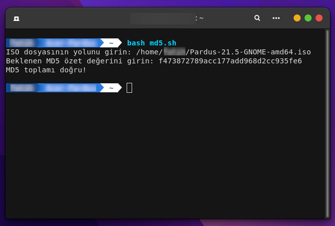

# Md5ISO-Verification
This tool I coded allows you to do md5 verification of the downloaded iso file

Install Git Clone 

Github Package Must Be Installed On Your Device.
```bash
sudo apt install git  -y
```

----------------------------------
# Installation
Install Md5ISO-Verification
```bash
sudo git clone https://github.com/cektor/Md5ISO-Verification.git
```
```bash
cd Md5ISO-Verification/
```
```bash
sudo chmod +x MD5ISO-verification.sh
```
```bash
./MD5ISO-verification.sh
```


# Screenshot


